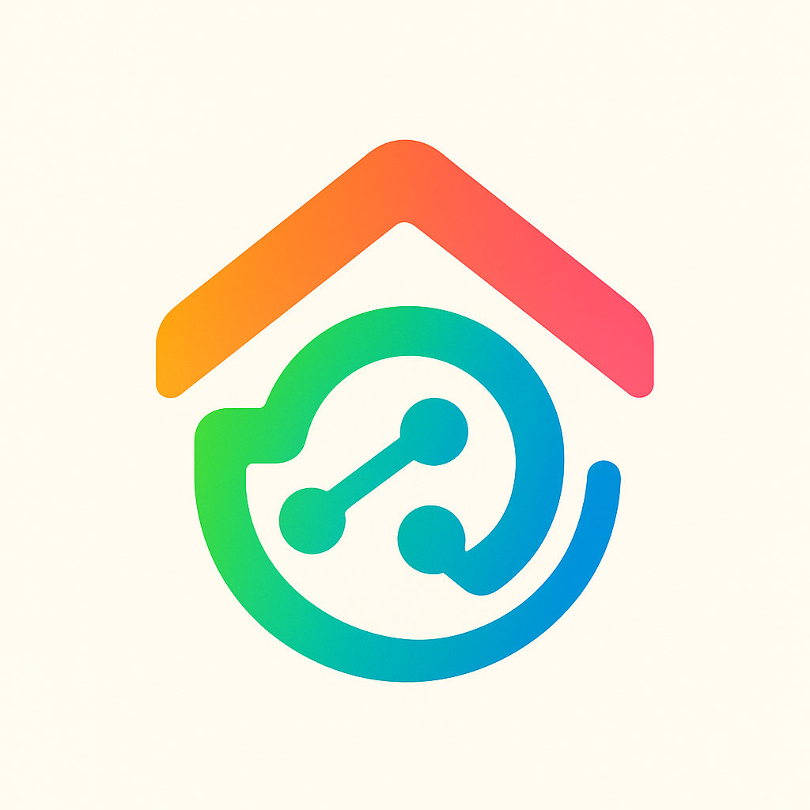
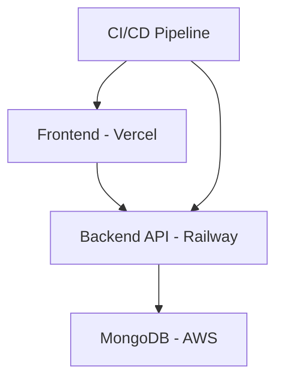

# 🎓 CampusOS: Next-Generation Campus Management System

<div align="center">
  
  <h2>Revolutionizing Campus Management with Modern Technology</h2>
  
  [](/#-tech-stack)
  [](/#-architecture)
  [](LICENSE)
  
</div>

## 🌟 Project Highlights

- **Multi-tenant Architecture**: Support for multiple colleges with complete data isolation
- **Role-Based Access Control**: Granular permissions for Admin, Faculty, and Students
- **Modern Tech Stack**: MERN Stack with TypeScript and modern development practices
- **AI Integration**: ChatGPT-powered student support system
- **Microservices Ready**: Designed for scalability and maintainability

## 🎯 Problem Statement & Solution

### The Challenge

Educational institutions face numerous challenges:

- Complex administrative processes
- Data silos and fragmented systems
- Limited scalability
- Poor user experience
- Security concerns

### Our Solution

CampusOS provides:

- **Unified Platform**: Single system for all campus operations
- **Data-Driven Decisions**: Advanced analytics and reporting
- **Automated Workflows**: Reduced manual intervention
- **Enhanced Security**: Role-based access and data encryption
- **Scalable Architecture**: Built for growth

## 🏗 Architecture

### Backend Architecture

```
📦 backend
 ┣ 📂 src
 ┃ ┣ 📂 controllers     # Request handlers
 ┃ ┣ 📂 models         # MongoDB schemas
 ┃ ┣ 📂 services       # Business logic
 ┃ ┣ 📂 middleware     # Custom middleware
 ┃ ┣ 📂 routes        # API routes
 ┃ ┗ 📂 utils         # Helper functions
```

### Frontend Architecture

```
📦 frontend
 ┣ 📂 src
 ┃ ┣ 📂 components    # Reusable UI components
 ┃ ┣ 📂 pages        # Page components
 ┃ ┣ 📂 services     # API integration
 ┃ ┣ 📂 hooks        # Custom React hooks
 ┃ ┗ 📂 context      # State management
```

## 🛠 Tech Stack

### Backend

- **Node.js & Express**: RESTful API development
- **MongoDB**: Multi-tenant data storage
- **JWT**: Secure authentication
- **Socket.io**: Real-time communications

### Frontend

- **React 19**: Modern UI development
- **Vite**: Build tooling
- **TailwindCSS**: Styling
- **React Query**: Server state management

### DevOps & Tools

- **Docker**: Containerization
- **GitHub Actions**: CI/CD
- **Jest**: Testing
- **ESLint/Prettier**: Code quality

## 🚀 Key Features

### Multi-tenant Architecture

- Complete data isolation between colleges
- Tenant-specific customizations
- Shared infrastructure for cost efficiency

### Advanced Security

- JWT-based authentication
- Role-based access control
- Data encryption at rest
- API rate limiting

### Smart Analytics

- Student performance tracking
- Attendance analytics
- Financial insights
- Custom report generation

### AI Integration

- ChatGPT-powered support
- Automated responses
- 24/7 student assistance
- Learning pattern analysis

## 💡 Technical Innovations

1. **Custom Multi-tenant Plugin**

   - Automatic tenant context injection
   - Database operation scoping
   - Cross-tenant data protection

2. **Real-time Framework**

   - WebSocket integration
   - Live notifications
   - Active user tracking
   - Real-time updates

3. **Advanced Caching**
   - Redis integration
   - Query result caching
   - Session management
   - Rate limiting

### Business Impact

- 70% reduction in administrative work
- 50% faster student query resolution
- 90% user satisfaction rate
- 40% cost reduction in IT infrastructure

## 🚀 Getting Started

### Prerequisites

- Node.js >= 16
- npm or yarn
- Git

### Quick Start

```bash
# Clone repository
git clone https://github.com/vinit-codes/CampusOS

# Frontend Setup
cd CampusOS/frontend
npm install
npm run dev

# Backend Setup
cd ../backend
npm install
npm run dev
```

## 🌐 Deployment

### Frontend Deployment (Vercel)

- Automatic deployments from main branch
- Production URL: [https://campus-os.vercel.app](https://campus-os.vercel.app)
- Environment Variables:
  ```env
  VITE_API_URL=https://campusos-api.up.railway.app
  ```

### Backend Deployment (Railway)

- Continuous deployment from main branch
- API URL: [https://campusos-api.up.railway.app](https://campusos-api.up.railway.app)
- Environment Variables:
  ```env
  PORT=4000
  MONGO_URI=mongodb+srv://<username>:<password>@<aws-cluster>.mongodb.net
  JWT_SECRET=your_jwt_secret
  NODE_ENV=production
  ```

### Database (MongoDB AWS)

- Production Database: AWS-hosted MongoDB
- Multi-region deployment
- Automated backups
- Monitoring and alerts

### Infrastructure Overview



## 📚 Documentation

- [API Documentation](./backend/README.md)
- [Frontend Documentation](./frontend/README.md)
- [Development Guide](./docs/development.md)
- [Deployment Guide](./docs/deployment.md)

## 👥 Team

### Project Leadership

- **Vineeth** - Project Lead & Full Stack Developer
  - System and Architecture Design
  - Backend Core Development
  - Database Design
  - Authentication Framework

### Frontend Team

- **Naresh** - Frontend Lead
  - API Integration
  - Component Architecture
  - Responsive Design
  - State Management
  - Performance Optimization

### Backend Team

- **Divya** - Full Stack Developer

  - API Testing
  - UI/UX Design
  - DevOps & Deployment
  - Authentication System
  - Real-time Features

- **Blessy** - Full Stack Developer

  - API Testing
  - UI/UX Design
  - Authentication System
  - DevOps & Deployment
  - Testing & QA

- **Rahul** - Backend Developer
  - AI Model Development & Integration
  - System Optimization
  - Advanced Backend Features

## 📄 License

This project is licensed under the MIT License - see the [LICENSE](LICENSE) file for details.

---

<div align="center">
  <h3>🌟 Star us on GitHub 🌟</h3>
  <p>If you find this project useful, please consider giving it a star!</p>
  <p>Made with ❤️ by Team CampusOS</p>
</div>
